<div align="center">
  <picture>
    <source media="(prefers-color-scheme: dark)" srcset="./dark.svg">
    <source media="(prefers-color-scheme: light)" srcset="./light.svg">
    
  </picture>
</div>

---

## ⚡ About Me

I am an **AI & Machine Learning Engineer** passionate about building robust, scalable, and intelligent production systems. My work centers on architecting autonomous **Multi-Agent workflows (LangGraph & CrewAI)**, developing high-precision **Retrieval-Augmented Generation (RAG)** systems, and training deep learning models with PyTorch. Backed by solid foundations in backend engineering and MLOps, I specialize in translating experimental AI research into high-throughput, containerized microservices deployed with FastAPI, Docker, and MLflow. I am dedicated to bridging the gap between cutting-edge LLMs and reliable, sub-second latency production applications.

---

## 🚀 Flagship AI Engineering Projects

### ⚖️ 1. [LegalDrishti AI](https://github.com/JaywardhanYadav/LegalDrishti-AI) — Two-Stage RAG Legal Intelligence & Document Research Platform
> *An enterprise-grade legal intelligence and consultation platform engineered for the Indian legal system (BNS, BNSS, BSA 2023) using a high-precision Two-Stage RAG pipeline backed by OpenAI and Weaviate.*

```
┌──────────────────┐     ┌─────────────────────┐     ┌────────────────────────┐
│  28 Indian Acts  │ ──> │ Recursive Chunking  │ ──> │ Weaviate HNSW Index    │
│  & Client Vault  │     │ + OpenAI Embeddings │     │ (Hybrid Dense + BM25)  │
└──────────────────┘     └─────────────────────┘     └───────────┬────────────┘
                                                                 │
┌──────────────────┐     ┌─────────────────────┐     ┌───────────▼────────────┐
│ Verified Legal   │ <── │ Dual-Stream Prompt  │ <── │ Cross-Encoder Reranker │
│ Strategy & Cites │     │ + GPT-4o Synthesis  │     │ (Top-5 Precision Chunks│
└──────────────────┘     └─────────────────────┘     └────────────────────────┘
```

- **Two-Stage Hybrid Retrieval:** Integrates an upstream **Statute Router (Regex + Weighted N-Grams)** with **Weaviate Hybrid Search** ($\alpha=0.5$ dense vectors + BM25) to isolate relevant statutory codes before vector retrieval.
- **Cross-Encoder Reranking (`FlashRank`):** Filters raw candidate pools (top-20) down to top-5 precision chunks, boosting **MRR@5 from 0.384 to 0.762 (+98.4%)** and achieving **86.8% Hit Rate @ 5** at **~68ms latency**.
- **Dual-Stream Context Synthesis:** Concurrently contextualizes codified statutes alongside private client evidence in **GPT-4o** with strict citation traceability (Act, Section, Page number).
- **Tech Stack:** `Python 3.12` • `FastAPI` • `OpenAI GPT-4o / Embeddings` • `Weaviate (HNSW)` • `PostgreSQL 17` • `Docker` • `Streamlit`

---

### 🗺️ 2. [PlanMyTrip AI](https://github.com/JaywardhanYadav) — Autonomous Multi-Agent Travel Planner
> *A collaborative, state-machine driven multi-agent travel architecture that coordinates real-time research, budget optimization, scheduling, and logistics.*

```
                     ┌─────────────────────────────┐
                     │   Orchestrator Supervisor   │
                     │    (Stateful Coordinator)   │
                     └──────────────┬──────────────┘
                                    │
         ┌──────────────────────────┼──────────────────────────┐
         ▼                          ▼                          ▼
┌──────────────────┐      ┌──────────────────┐      ┌──────────────────┐
│  Weather & Geo   │      │ Budget & Routing │      │ Itinerary & Cult │
│   Worker Agent   │      │   Worker Agent   │      │   Worker Agent   │
└──────────────────┘      └──────────────────┘      └──────────────────┘
```

- **Hierarchical Agent Graph:** Leverages **LangGraph** to model multi-turn state transitions, loop validation, and conditional agent dispatch.
- **Autonomous Tool Execution:** Agents utilize search APIs, geocoding, and currency converters to fetch ground-truth travel parameters.
- **Dynamic Constraint Resolution:** Resolves budget-time tradeoffs by autonomously adjusting activities and transit modes.
- **Tech Stack:** `Python` • `LangGraph` • `LangChain` • `FastAPI` • `Pydantic` • `Tavily Search API` • `Next.js`

---

### 🤖 3. [Customer Support AI](https://github.com/JaywardhanYadav) — Agentic RAG with Dynamic Tool Calling
> *Context-aware autonomous agent equipped with persistent conversational memory buffers, enterprise knowledge grounding, and live external API execution.*

- **Conversational Memory:** Uses windowed buffer memory and summarized vector history for long-term customer context retention.
- **Function Dispatching:** Dynamically executes account checks, ticket status lookups, and escalations via structured JSON schema tool calling.
- **Tech Stack:** `Python` • `LangChain` • `OpenAI API` • `Vector Database` • `FastAPI` • `Docker`

---

### ⚙️ 4. [End-to-End MLOps Pipeline](https://github.com/JaywardhanYadav) — Automated Training, Tracking & Deployment
> *Production-grade continuous training and deployment pipeline with data drift detection, automated model registry, and containerized serving.*

- **Experiment Tracking:** Centralized metric, hyperparameter, and artifact versioning powered by **MLflow**.
- **Automated CI/CD:** GitHub Actions workflows for linting, unit testing, model packaging, and Docker image publishing.
- **Sub-50ms Inference Service:** Deployed with **FastAPI** + **Gunicorn** / **Uvicorn** worker pools with comprehensive health check telemetry.
- **Tech Stack:** `MLflow` • `Docker` • `FastAPI` • `GitHub Actions` • `Scikit-Learn` • `AWS EC2/S3`

---

## 🛠️ Technical Arsenal

<div align="center">

| Domain | Technologies & Frameworks |
| :--- | :--- |
| **Agentic & Generative AI** | `Agentic AI` • `LangGraph` • `LangChain` • `CrewAI` • `RAG (Dense/Sparse)` • `Function Calling` • `Prompt Engineering` |
| **LLMs & Embedding Models** | `OpenAI GPT-4o` • `Claude 3.7` • `DeepSeek-R1` • `Hugging Face Transformers` • `Sentence-Transformers` • `Ollama` |
| **Vector Stores & Databases** | `Qdrant` • `Pinecone` • `ChromaDB` • `PostgreSQL (pgvector)` • `Redis` • `SQLite` |
| **Machine Learning & Core** | `Python` • `PyTorch` • `Scikit-Learn` • `NumPy` • `Pandas` • `NLP` • `Feature Engineering` |
| **Backend & Architecture** | `FastAPI` • `REST APIs` • `Pydantic` • `System Design` • `AsyncIO` • `Microservices` |
| **MLOps & Infrastructure** | `Docker` • `AWS (EC2, S3)` • `DVC` • `DagsHub` • `MLflow` • `CI/CD Pipelines` • `Git` • `Linux` |

</div>

<br/>

<div align="center">
  
  
  
  
  
  
  
  
  
  
  
  
  
  
  
</div>

---

## 📈 Engineering Activity & Metrics

<div align="center">
  <table border="0">
    <tr>
      <td>
        
      </td>
      <td>
        
      </td>
    </tr>
  </table>

  <br/>

  
</div>

---

## 🌐 Connect & Collaborate

I am actively open to **AI/ML Engineering roles**, **GenAI / Multi-Agent consulting**, and **innovative open-source collaborations**.

<div align="center">
  <a href="https://jaywardhanportfolio.netlify.app/">
    
  </a>
  &nbsp;
  <a href="https://www.linkedin.com/in/jaywardhanyadav/">
    
  </a>
  &nbsp;
  <a href="mailto:jaywardhan.tech@gmail.com">
    
  </a>
  &nbsp;
  <a href="https://github.com/JaywardhanYadav">
    
  </a>
</div>

<br/>

<div align="center">
  <sub>⚡ Designed with pure SVG animations &amp; crafted for modern AI Engineering standards. Built by <a href="https://github.com/JaywardhanYadav">Jaywardhan Yadav</a>.</sub>
</div>
